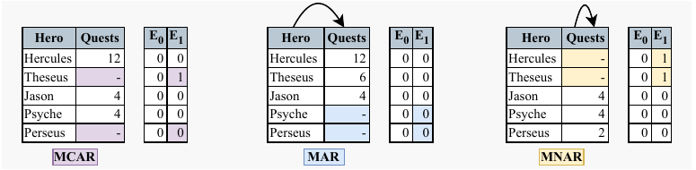
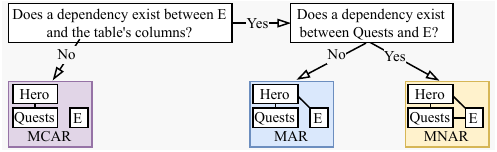

# MechDetect
Code accompanying the MechDetect paper.

An example of MechDetect as seen in the paper.

## Results Replication
1. Unzip/tar the OpenML datasets via `tar -xzvf src/auc_roc_scores/datasets.tar.gz src/auc_roc_scores/datasets`.
2. Run the generation & aggregation of AUC-ROC scores via `./src/auc_roc_scores/run_all_experiments.sh`.
3. Run notebooks with the uv kernel in `src/auc_roc_analysis.ipynb` and `src/accuracy_analysis.ipynb`.

## Usage
The following guide provides details on how to replicate the results of the MechDetect paper. Note that the final AUC-ROC scores are cached so the visualizations can be recreated without running the full mech detect algorithm. As this is experiment code, a full standalone MechDetect package is not yet available. We plan to build and release this if the paper is well recieved by the community.

We describe what the process to obtain the results is before providing step-by-step instructions to replicate them. Essentially, there is a file that trains models to predict the error masks in the task settings: `src/auc_roc_scores/testing.py`. This is run with a bash script: `src/auc_roc_scores/run_all_experiments.sh`. The results are then saved in individual directories where a python script to compile these into a single .npz file is used: `src/auc_roc_scores/make_data_cube.py`. The final cube is saved in `src/auc_roc_scores/data/auc_roc_tensors_dict.npz` which is the file the two notebooks read from. Once this file is created, all plots from the paper can be created using the notebooks `src/auc_roc_analysis.ipynb` and `src/accuracy_analysis.ipynb`. Note that if the results are to be replicated quickly it is recommended to parallelize/distribute the individual jobs of the `src/auc_roc_scores/run_all_experiments.sh` script. Due to the heterogeneity of compute infrastructure, we thought that leaving the results in this form was most applicable to the widest audience.

## Description of Files
- `src/auc_roc_scores` contains the code to obtain the AUC-ROC scores that are used in MechDetect.
    - `src/auc_roc_scores/testing.py` is the code that trains models to predict error masks and records the AUC-ROC values.
    - `src/auc_roc_scores/make_data_cube.py` is the script that compiles all of the individual .npy files into 
    - `src/auc_roc_scores/run_all_experiments.sh` is the file that executes all experiments to get the AUC-ROC scores.
    - `src/auc_roc_scores/data` contains the tensors of AUC-ROC scores for the various instances of the experiments.
    - `src/auc_roc_scores/results` contains directories for each dataset id with the AUC-ROC scores and metadata.
    - `src/auc_roc_scores/datasets.tar.gz` contains the .csv files for each of the datsets from the analyses.
- `src/auc_roc_analysis.ipynb` contains the code associated with the analysis of the AUC-ROC scores under various mechanisms and tasks.
- `src/accuracy_analysis.ipynb` contains the code associated with the analysis of the accuracy of MechDetect. The testing logic is contained here.
- `plots` contains the plots produced by the code for the paper.
